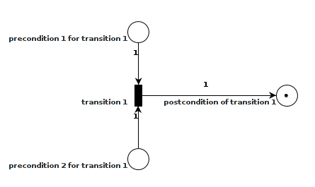

# Programming through Petri Net building

## Background
A [function](https://en.wikipedia.org/wiki/Function_(mathematics))'s sole reason to exist in a software project is to do *something* based on it's input parameters. Once the function has done it's work, it returns *something else*. In many cases this output is used as input to several other functions. A function is not concerned with how or when the input parameter/state was created, or if it is used by other functions. Functions which do not depend on eachother are [serializable](https://en.wikipedia.org/wiki/Serializability#Serializability) and can thus be executed in any order or in parallell, without affecting the rest of the program. In conventional programming however the developer typically defines the order of invocation explicitly and implement measures on top of this to enable concurrent execution.
### Idea
The idea behind this project is that greater [concurrency](https://en.wikipedia.org/wiki/Concurrency_(computer_science)) may be achieved, with less code if the programmer does not have to explicitly decide the order of operations in the program. Instead, the programmer places the responsibility of function invocation and [multithreading](https://en.wikipedia.org/wiki/Thread_(computing)#Multithreading) into the background by defining a [Petri net](https://en.wikipedia.org/wiki/Petri_net) using a third party library (this). Once defined, a multithreaded scheduler can handle all function invocations, such that functions can only be invoked once all requirements are satisfied. Requirement in this setting being that each of the function's input parameters has been instantiated. The function is central to this concept. The programmer simply writes the functions that produces something based on what they require (input parameters). When the program is executed a Petri Net is built based on function definitions/signatures, then the scheduler takes over execution until the system is dead.
#### Petri Net introduction
A Petri net is a discrete event dynamic system which can describe distributed systems. The system contains transitions representing events that occurs, places represening conditions and arcs between transitions and places describe pre and post conditions for transitions. The state of the system is defined by the the number of tokens in each place. A transition T in a system is said to be enabled if for each arc from place Pi to T there is a token in Pi. By definition, any transition in the system may fire if it is enabled. This makes Petri nets an excellent tool for describing concurrent systems.
##### Transitions
When a transition *fires*, it consumes tokens from it's input places, and deposits new tokens in it's output places. The next two figures shows a system where the transition (box) is initially enabled since there is a token in each input place (circle). When the transition fires, the two tokens in it's input places are consumed, and a new token is put in the output place. In that state the Petri Net is dead, as no transition is enabled.

##### Conflict
In a Petri net where multiple transitions share the same input or output places, conflicts are possile due to nondeterministic transition firing order. When writing concurrent software, we want to avoid conflict, or in other words, we want the system to be serializable. For this purpose a subclass of Petri nets known as [Marked Graph](https://en.wikipedia.org/wiki/Marked_graph) may be helpful.
#### Marked Graph introduction
A marked graph is a Petri net where every place is restricted to having exactly one incoming arc, and one outgoing arc. With this constraint, the system can model concurrency, but it remains conflict free.
### Program design patterns
## Project goals
1. Develop a python library to automate marked graph building from function signatures, as well as a multithreaded scheduler
2. Determine if developing programs in this manner is feasible, by developing a proof of concept program for visualization of graphs built with this library
3. Implement a high level abstraction to simplify fork-join based parallellism on iterable types where operations can be applied to items independently
4. Examine feasibility of including support for GPGPU and grid computing through abstractions
5. Examine the following potential advantages and consequences of this style of programming
  * Concurrency handled in the background without programmer having to deal with threads
  * Model of program is built while programming, thus the architecture of the full program can easily be visualized even when under development
  * The model can be analyzed with established Petri net theory to discover potential defects
  * Profiling the full program be done by toggling a flag in the scheduler, and the timing information can be viewed in a graph
  * Deciding if the effort of optimizing a particular part of the program is worth it can be made by introducing cycles in the Petri net
  * Debugging a faulty program can be simplified, by keeping a backlog of the states of the Petri Net, which can be analyzed after a crash
  * Parts of program can be mocked, thus encouraging test driven development
  * Modular design and separation of concerns
  * Program flow can be changed by replacing a transition's assigned function, thus allowing both offline and online changes to be easily applied
